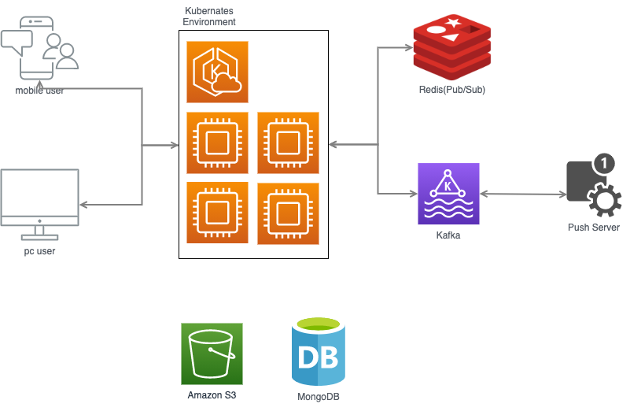
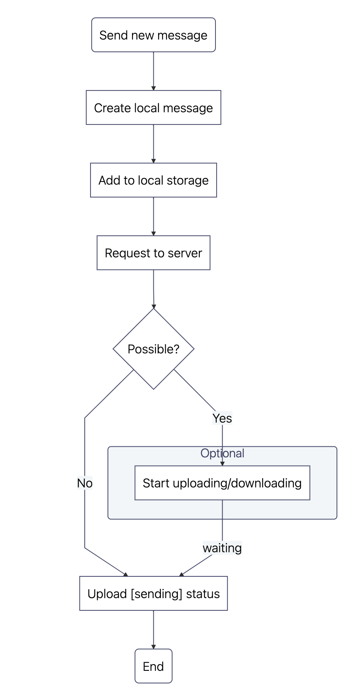
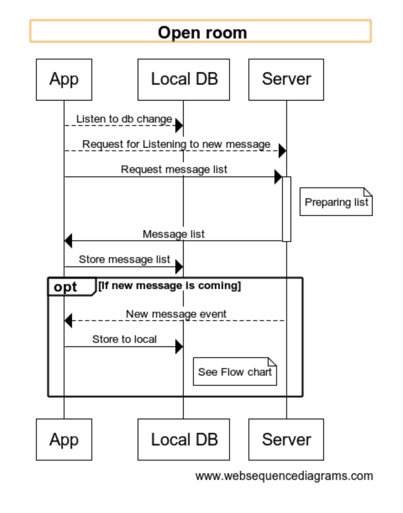

# Chat Api

채팅 API

## Table of Contents
  - [Features](#features)
  - [Road Map](#roadmap)
  - [Server Artitucture](#serverartitucture)
  - [Data Structure](#datastructure)
  - [Error Codes](#errorcodes)
  - [Interfcae](#interface)
  - [Usage](#usage)
  - [Chat API List](#chatapilist)
  - [Platform API List](#platformapilist)


## Features
  - NodeJs/NestJs/Typescript/Scoket.io 기반의 채팅엔진
  - 1:1채팅, 그룹채팅
  - 텍스트, 이미지, 비디오, 파일등 데이터 송수신
  - 멀티미디어 데이터 다운로드
  - 읽음/읽지 않은 메세지
  - 푸시알림
  - 채팅방 알림 온/오프
  - 채팅방 얼리기
  - 채팅방 및 메세지 검색
  - 멀티미디어 타입 메세지 모아보기

## RoadMap
  * 현재적용된 것 
    - 1:1채팅, 그룹채팅
    - 텍스트, 이미지, 비디오, 파일등 데이터 송수신
    - 멀티미디어 데이터 다운로드
    - 읽음/읽지 않은 메세지 카운트
    - 푸시알림
    - 채팅방 알림 온/오프
    - 오프라인 모드 지원
    - Ban User(추방)
    - 채팅방 얼리기
    - 채팅방 입장시 유저의 마지막 읽은 메세지로 스크롤 이동
    - 메세지별 읽음/읽지 않은 유저 리스트
    - 푸시메세지 터치시 해당 채팅방으로 이동
    - 유저 및 채팅방 검색
    - 메세지 내용 검색
    - 발언권 제외: Mute User
    - 이미지/링크/비디오 갤러리
    - 메세지 공유
    - 채팅방내 공지사항(Announcements) 등록

  * 미적용된것
    - 답글
    - 멘션(ex: @홍길동)
    - 유저의 온/오프라인표시
    - 금지어 필터링
    - 메세지 내역 다운로드 및 이메일로 보내기(Data Export)
    - 실시간 입력표시기(Typing indicators) ***1:1방에서만 가능***


## ServerArtitucture


## DataStructure
```javascript
class Room {
  _id: string;

  name: string; //채팅방 이름

  //link information
  link?: {
    sid: string,
    name: string
  }

  //참여한 유저 리스트
  joinUsers: [{
    _id: {
      type: String,
      required: true,
    },
    nickName: {
      type: String,
      required: true,
    },
    profileUrl: {
      type: String,
      default: null,
    },
    //마지막 읽은 메세지
    lastReadMessageId: {
      type: String,
      default: null,
    },
    //방장(방생성자)여부
    master: {
      type: Boolean,
      default: false,
    },
    //채팅방 알림설정
    alarmOn: {
      type: Boolean,
      default: true,
    },
    meta: {
      type: {
        email: String,
        phone: String,
      },
      default: null,
    },
    createdAt: {
      type: Date,
      default: Date.now,
    },
  }];

  //채팅방규칙설정
  rules: {
    //메세지복사
    canCopyMessage: { type: Boolean, default: true, },
    //화면캡쳐
    canCaptureMessage: { type: Boolean, default: true, },
    //메세지삭제
    canDeleteMessage: { type: Boolean, default: true, },
    //메세지공유
    canShareMessage: { type: Boolean, default: true, },
    //회원초대
    canInviteMemebrs: { type: Boolean, default: false },
    //채팅방나가기
    canLeaveOutRoom: { type: Boolean, default: false },
    //채팅방내 회원보기
    canShowMemberList: { type: Boolean, default: true },
    //메세지전송 및 받기
    isFreezed: { type: Boolean, default: false },
  };

  //마지막 메세지
  lastMessage: Message | null;

  //meta
  meta?: Object | null;

  createdAt: Date;

  //읽지않은 메세지 수
  unReadMsgCount: number;
}
```

```javascript

enum MessageType {
  "TEXT",
  "PHOTO",
  "VIDEO",
  "FILE",
  "CARD",
  "ADMIN"
}

class Message {
  _id: string;

  //메세지키(유니크한키로 사용)
  syncKey: string;

  roomId: string;

  author: {
    authorId: string;
    nickName?: string;
    profileUrl?: string;
  };


  data: {
    //enum: TEXT, PHOTO, VIDEO, FILE, CARD, ADMIN
    type: MessageType,
    content: {
      //type이 TEXT 또는 ADMIN 일때 사용
      text?: string;
      //type이 FILE, VIDEO, PHOTO일때 사용
      files?: {
        //파일이름
        name: string;
        //파일경로(s3)
        path: string;
        //파일크기
        size: number;

        //썸네일 이미지 경로
        thumbnail?: string;
        //비디오 재생시간
        duration?: number;
        //이미지일 경우 이미지의 프레임사이즈
        frameSize?: {
          width: number;
          height: number;
        }
      }[],
      //MessageType 이 CARD일때 사용된다
      rawData?: {
        //ex) enum: LINK_INVITATION,PRODUCT_DRAWING,PRODUCT_DRAWING_WINNER ...
        cardType: MessageCardType;
        text?: string;
        link?: {
          sid: string;
          name: string;
          profileUrl: string;
        };
        acceptedStatus?: boolean;
        image?: string;
        buttons? {
          title: string;
          //enum: link, product, webview
          action: CardButtonAction;
          value?: Record<string, any>;
        }[];
        productApplicationId?: string;
      }
    }
  };

  meta?: Record<string, any>;

  status?: {
    deleted?: boolean;
    hidden?: boolean;
  }

  createdAt: Date;
}
```

### Interface
```javascript
interface ChatResponse<T> {
  success: boolean;
  error?: string | null;
  data?: T | null;
}
```

## ErrorCodes
|Error|내용|비고|
|------|---|---|
|**CLIENT_ID_NO_EXISTS**|socket client의 아이디가 존재하지 않음|유효하지 않은 커넥션이므로 connect 재요청후 다시시도|
|**ROOM_NO_EXISTS**|방정보가 존재하지 않음|잘못된 roomId를 보냄|
|**FILE_NO_EXISTS_WITH_SYNC_KEY**|파일업로드시 syncKey에 해당되는 데이터가 존재하지 않음|파일전송을 처음부터 다시시도|
|**SEND_FILE_IS_EMPTY**|파일업로드시 전송한 파일데이터가 존재하지 않음|파일전송 다시시도|
|**WRONG_TARGET_USER_IDS**|회원초대시 target_user_ids에 유효한 회원아이디가 한개도 존재하지 않음|target_user_ids에 유효한 회원정보를 전달|
|**JOIN_USER_ALREADY_EXISTS**|회원초대시 target_user_ids가 전부 이미 방에 존재하는 회원일 경우|target_user_ids에 유효한 회원정보를 전달|


## ChatAPIList
> **클라이언트 개발시 socket.io[공식문서](https://socket.io/docs/v3/) 참고**

|event name|event type(<span style="color:red">emit</span>\|<span style="color:blue">listener</span>)|내용|
|------|---|---|
|**[listenRooms](#listenrooms)**|<span style="color:red">emit</span>|채팅방 리스트 조회|
|**queryRooms**|<span style="color:red">emit</span>|채팅방 리스트 조회|
|**joinRoom**|<span style="color:red">emit</span>|채팅방 입장|
|**leaveRoom**|<span style="color:red">emit</span>|채팅방 나가기|
|**leaveOutRoom**|<span style="color:red">emit</span>|채팅방 탈퇴|
|**listenMessagesByRoom**|<span style="color:red">emit</span>|특정 채팅방 메세지 리스트 조회|
|**sendMessage**|<span style="color:red">emit</span>|Text 메세지 보내기|
|**sendFileMessage**|<span style="color:red">emit</span>|File or Video or Photo 타입의 파일 전송|
|**createNewRoom**|<span style="color:red">emit</span>|채팅방 생성|
|**inviteRoom**|<span style="color:red">emit</span>|채팅방에 유저 초대|
|**kickOutUsers**|<span style="color:red">emit</span>|마스터가 회원을 방출|
|**roomAlarmTurnOnOff**|<span style="color:red">emit</span>|채팅방 푸시알림 켬/끔|
|**updateRoomSetting**|<span style="color:red">emit</span>|채팅방의 설정 변경|
|**listenRoom**|<span style="color:blue">listener</span>|채팅방에 신규 참여자가 생기거나 기존 참여자가 나갈때 이벤트 발생|
|**updateRoomLastMessage**|<span style="color:blue">listener</span>|채팅방의 마지막메세지 업데이트시 이벤트 발생|
|**listenMessage_**${roomId}|<span style="color:blue">listener</span>|채팅방의 신규메세지 이벤트 수신|
|**progress_**${syncKey}|<span style="color:blue">listener</span>|파일메세지 전송시 진행율 이벤트 수신|


#### Connect
```javascript
const io = require("socket.io-client");
this.$socket = io("ws://example.com/my-namespace", {
  transports: ["websocket"],
  withCredentials: false, //CORS 회피
  auth: {
    token: "user token"
  }
});
```

#### ListenRooms
> **채팅방 리스트 가져오기**
> When connection is succefully established, get room list!

##### Request 
  ###### - Operation
  ```listenRooms```
  ###### - Operation type
  ```Web Socket```

##### Example
```typescript
const payload = {
  roomType: string|null, //SYSTEM_ALARM, ALARM, GROUP, INQUIRY
  linkSid: string|null
}
this.$socket.emit('listenRooms', payload, (data: ChatResponse<{ list: Room[] }>) => {
  // {
  //   success: true|false,
  //   error: "CLIENT_ID_NOT_EXISTS"|null
  //   data: {
  //     list: []
  //   }
  // }
  console.log('listenRooms', data.data.list);
});
```

  #### ListenRoom
  > 한 개의 채팅방에서 신규 참여자가 발생하거나 기존 참여자가 이탈 할 때, 해당 이벤트를 수신
  > 채팅방에 신규 참여자가 생기거나 기존 참여자가 나갈때 이벤트 발생
  > listen updated room for joinUsers

  ```javascript
  this.$socket.on('listenRoom', (data: Room) => {});
  ```

  #### UpdateRoomLastMessage
  채팅방의 마지막메세지 업데이트시 이벤트 발생

  ```javascript
  this.$socket.on('updateRoomLastMessage', (data: Room) => {});
  ```

  #### JoinRoom and LeaveRoom
  when you enter one of rooms, emit event join room with roomId
  if there is active room, before you enter new room, just emit leaveRoom event!

  ```javascript
  this.$socket.emit('leaveRoom', "roomId", (data: ChatResponse<{ result: boolean }>) => {
    // {
    //   success: true|false,
    //   error: ""|null
    //   data: {
    //     list: []
    //   }
    // }

    //방에서 나가기!
  });
  this.$socket.emit('joinRoom', "roomId", (data: ChatResponse<{ result: boolean }>) => {
    // {
    //   success: true|false,
    //   error: ""|null
    //   data: {
    //     list: []
    //   }
    // }
    if (data.success && data.data.result) {
      //now you can change active room!

      //you read all messages of this room
      room.unReadMsgCount = 0;
    }
  });
  ```

  #### LeaveOut Room
  채팅방 나가기
  ```javascript
  this.$socket.emit('leaveOutRoom', "roomId", (data: ChatResponse<{ result: boolean }>) => {
    // {
    //   success: true|false,
    //   error: ""|null
    //   data: {
    //     list: []
    //   }
    // }
    //현재 채팅방에서 나가기
  });
  ```

  #### ListenMessagesByRoom
  ```javascript
  const payload = {
    roomId: string,
    lastMessageId: string|null, //이전 메세지 더불러올경우, null이면 최신메세지를 가져옴
    count: number //기본값은 10
  };
  this.$socket.emit('listenMessagesByRoom', payload, (data: ChatResponse<{ list: Message[] }>) => {
    // {
    //   success: true|false,
    //   error: ""|null
    //   data: {
    //     list: []
    //   }
    // }
    //data.data.list == Message[]
    console.log(data.data.list);
  });
  ```

  #### ListenMessage_${roomId}
  ```javascript
  this.sockets.on(`listenMessage_roomId`, (message: Message) => {});
  ```


  #### SendMessage
  * sendMessage is for TEXT message!
  ```javascript
  const payload = {
    syncKey: new Date().getTime().toString(), //this is example, this shoud be unique string value!
    roomId: "roomId",
    data: {
      type: 'TEXT',
      content: "메세지내용",
    },
  };
  this.$socket.emit('sendMessage', payload, (data: ChatResponse<{ result: boolean }>) => {
    // {
    //   success: true|false,
    //   error: ""|null
    //   data: {
    //     result: true|false
    //   }
    // }
    //data.data.result.list == Message[]
    console.log(data.data.result.list);
  });
  ```

  #### SendFileMessage
  * you have to slice file size by 500kb
  ```javascript
  const payload = {
    syncKey: new Date().getTime().toString(), //this is example, this shoud be unique string value!
    data: buffer, //sliced file buffer by 500kb
    type: enum(["FILE", "VIDEO", "PHOTO"]),
    size: totalFileSize,
    name: "fileName",
    roomId: "roomId",
  };
  this.$socket.emit(
    'sendFileMessage',
    payload,
    (data: ChatResponse<any | null>) => {
      // {
      //   success: true|false,
      //   error: ""|null
      //   data: {
      //     slice: number
      //     progress: number
      //   }
      // }

      //slice, progress는 파일이 전송이 완료되지 전까지 유효한 데이터!
      if (data.slice) {
        var place = data.slice * 50000;
        var slice = this.tempFile.slice(
          place,
          place + Math.min(50000, this.tempFile.size - place),
        );

        //for next chunked file
        this.sendFileMessage(slice);
      }
    },
  );
  ```

  ### Progress Listener
  ```javascript
    //sendFileMessage를 시작할 경우 progress 리스너를 구독!
    //sendFileMessage가 끝나면 해당리스너를 구독해재!
    this.sockets.on(`progress_${this.messageKey}`, (progress: double) => {
      console.log(progress);
    });
    this.sockets.off(`progress_${this.messageKey}`);
  ```

  #### UpdateReadMessage
  * just pass the lastMessageId of the room!
  * 마지막 읽은 메세지
  ```javascript
  const payload = {
    roomId: "roomId",
    messageId: lastMessageId,
  };
  this.$socket.emit('updateReadMessage', payload, (data: ChatResponse<{ result: boolean }>) => {
    // {
    //   success: true|false,
    //   error: ""|null
    //   data: {
    //     result: true|false
    //   }
    // }
    console.log(data.data.result);
  });
  ```


  #### CreateRoom
  * 임시적으로 사용되는 API, 채팅방 생성에 대한 상세기획이 나오면 메인 API서버에서 처리하는것으로 바뀔 예정
  ```javascript
  const payload = {
    users: ["userId"],
    name: "roomName",
    rules: {
      canInviteMemebrs: true|false,
      canLeaveOutRoom: true|false,
      canCopyMessage: true|false,
      canCaptureMessage: true|false,
      canDeleteMessage: true|false,
      canShareMessage: true|false,
      canShowMemberList: true|false,
      isFreezed: true|false,
    }
  };
  this.$socket.emit('createNewRoom', payload, (data: ChatResponse<Room>) => {
    // {
    //   success: true|false,
    //   error: ""|null
    //   data: Room
    // }
    console.log(data.data);
  });
  ```

  #### InviteUsers
  ```javascript
  const payload = {
    roomId: "roomId",
    targetUserIds: ["userId"],
  };
  this.$socket.emit('inviteRoom', payload, (data: ChatResponse<{ result: boolean }>) => {
    // {
    //   success: true|false,
    //   error: ""|null
    //   data: {
    //     result: true|false
    //   }
    // }
    console.log(data.data.result);
  });
  ```

  #### KickOutUsers
  ```javascript
  const payload = {
    roomId: "roomId",
    targetUserIds: ["userId"],
  };
  this.$socket.emit('kickOutUsers', payload, (data: ChatResponse<{ result: boolean }>) => {
    // {
    //   success: true|false,
    //   error: ""|null
    //   data: {
    //     result: true|false
    //   }
    // }
    console.log(data.data.result);
  });

  #### UpdateReadMessage
  * when you join chat room, you can read the last message of the room
  * 채팅방에 입장시 마지막메세지 읽음 처리

  ```javascript
  const payload = {
    roomId: "roomId",
    messageId: "messageId",
  };
  this.$socket.emit('updateReadMessage', payload, (data: ChatResponse<{ result: boolean }>) => {
    // {
    //   success: true|false,
    //   error: ""|null
    //   data: {
    //     result: true|false
    //   }
    // }
    console.log(data.data.result);
  });
  ```

  #### Turn On/Off Alarm
  * about push alram option for the room
  * 채팅방 푸시알림 켬/끔

  ```javascript
  const payload = {
    roomId: "roomId",
    messageId: "messageId",
  };
  this.$socket.emit('roomAlarmTurnOnOff', payload, (data: ChatResponse<{ result: boolean }>) => {
    // {
    //   success: true|false,
    //   error: ""|null
    //   data: {
    //     result: true|false
    //   }
    // }
    console.log(data.data.result);
  });
  ```

  #### Update Room Setting
  * about update room name or rules
  * 채팅방이름 및 룰변경(종료등)

  ```javascript
  const payload: {
    roomId: string,
    updateData: {
      name?: string|null;
      rules?: {
        canInviteMemebrs: boolean;
        canLeaveOutRoom: boolean;
        canCopyMessage?: boolean;
        canCaptureMessage?: boolean;
        canDeleteMessage?: boolean;
        canShareMessage?: boolean;
        canShowMemberList?: boolean;
        isFreezed?: boolean;
      }
    },
  };
  this.$socket.emit('updateRoomSetting', payload, (data: ChatResponse<{ result: boolean }>) => {
    // {
    //   success: true|false,
    //   error: ""|null
    //   data: {
    //     result: true|false
    //   }
    // }
    console.log(data.data.result);
  });
  ```

## PlatformAPIList
  > HTTP API 형태의 채팅 API
  > 인증된 플랫폼에서 허가 받은 chat-api-key를 header에 실어 보내주세요.

```javascript
  axios({
    url: CHAT_API_SERVER,
    method: METHOD,
  }, {
    headers: {
      'chat-api-key': API_KEY
    }
  })
```

### Actions
|Action|HTTP Request|Description|
|------|------|--------|
|**[CreateRoomWithMessage](#createroomwithmessage)**|**POST** /chat/room|채팅방 생성과 메세지 생성|
|**[InviteUsersToRoom](#inviteuserstoroom)**|**POST** /chat/inviteUsers|채팅방에 유저를 초대|

#### CreateRoomWithMessage
>**채팅방 생성하기**
> 채팅방 생성시 메세지를 같이 생성할 수 있음
> **Note:**`Room.roomType` 이 `GROUP(그룹채팅)`일때 참여한 유저와 `link.sid(링크아이디)` 를 비교하여 방이 이미 존재하면 생성하지 않습니다.
> **Note:** `Room.rules.isFreezed == true` 종료된 방일때 새로운방을 생성합니다.

```typescript
  POST https://{APPLIOCATION_ENV}-api.dingdongu.com/chat/room
```
```typescript
  BODY {
    name: string;
    profileUrl?: string;
    roomType: string; //GROUP|INQUIRY
    joinUsers: [{
      _id: string;
      nickName: string;
      profileUrl?: string;
      master: boolean;
      meta?: Record<string, any>;
    }],
    link: {
      sid: string;
      name: string;
    };
    message: {
      author: {
        authorId: string;
        nickName: string;
        profileUrl?: string;
      },
      data: {
        type: string, //TEXT|ADMIN
        content: {
          text: string, //message content
        }
      }
    },
    meta?: Record<string, any>;
  }
```
```typescript
  RESPONSE
    
    Status: 200 OK
      Room
    
    Status: 500 Error
      ROOM_ALREADY_EXISTS //이미 방이 존재
```


#### InviteUsersToRoom
> **채팅방에 유저 초대하기**
> **Note:** 유저를 초대하는 회원은 해당 채팅방의 master이어야 합니다.
> **Note:** 해당방에 이미 존재하는 회원이 있다면 해당회원은 중복해서 입장되지 않으며 중복된 회원은 제한후 입장 됩니다.
> **Note:** 중복되지 않은 회원이 존재하지 않을시 에러를 리턴합니다.

```typescript
  POST https://{APPLIOCATION_ENV}-api.dingdongu.com/chat/inviteUsers
```
```typescript
  BODY {
    roomId: string;
    inviterId: string;
    joinUsers: [{
      _id: string;
      nickName: string;
      profileUrl?: string;
      master: boolean;
      meta?: Record<string, any>;
    }];
  }
```
```typescript
  RESPONSE
    
    Status: 200 OK
      Room
    
    Status: 500 Error
      ROOM_NO_EXISTS //채팅방이 존재하지 않습니다.
      ROOM_IS_FREEZED_CAN_NOT_BE_CHANGED //종료된 채팅방입니다.
      ROOM_RULES_CAN_NOT_INVITE_MEMBERS //유저를 초대할 수 없는 방입니다.
      INVITER_ID_IS_NOT_MASTER //inviter가 해당방의 master가 아닙니다.
      JOIN_USERS_EMPTY //초대한 회원이 없습니다.
```
   
<!-- ## Client App Flow Chart

 -->